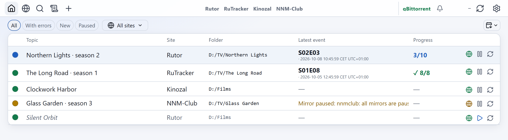

<div align="center">

# TOW

**Torrent topic watcher.** Follows tracker topics that replace their `.torrent` in place and adds every new
revision to your torrent client.

[](https://github.com/d0j/tow/actions/workflows/ci.yml)
[](https://github.com/d0j/tow/releases/latest)
[](LICENSE)
[](.python-version)
[](#install)

**English** · [Русский](README.ru.md)

[Install](#install) · [Usage](#usage) · [Remote access](#remote-access) · [Update and backups](#update-and-backups) ·
[Docs](#documentation) · [Changelog](CHANGELOG.md)

<picture>
  <source media="(prefers-color-scheme: dark)" srcset="docs/images/home-en-dark.png">
  
</picture>

</div>

## Features

- **Watch or add once.** All files, chosen episodes (`S01E03-E05`, `04x01-03`) or patterns (`*.mkv`).
- **Confirmed adds.** The torrent is added stopped, files are selected, the selection is read back, then it starts.
  A failure is reported as a failure.
- **Mirrors.** Several addresses per site with fallback and cooldown; daily download limits respected; sign-in by
  password or a browser window.
- **Notifications.** One message per topic per check, quiet hours, a daily digest, a queue that survives restarts.
- **History and undo.** Every file and revision is recorded; the last change can be undone.
- **Backups.** Signed night copies, restore points, encrypted `.towx` transfer files.
- **One folder.** Code, settings, data, key, backups and its own Python. Move it and it keeps working.
- **Interface** in English and Russian; a new language is one JSON file.
- **Moving from Monitorrent?** `tow import-monitorrent` brings over its topics and site logins.

## Supported

| | |
|---|---|
| **Sites** | rutor, Kinozal, NNM-Club, RuTracker, Tapochek, UnionPeer, fast-torrent; others by hand |
| **Torrent clients** | qBittorrent (Web UI), Transmission 3.0+, Deluge 2.x |
| **Notifications** | Telegram, Discord, WhatsApp (CallMeBot), ntfy |
| **Systems** | Windows 10/11, Linux, macOS (Apple silicon) — all three in CI |

## Install

**Windows.** [Download **TOW-windows-x64.zip**](https://github.com/d0j/tow/releases/latest/download/TOW-windows-x64.zip),
extract it anywhere, double-click **Start TOW.cmd**. Everything is inside the folder; the first start needs no
internet. Or in PowerShell:

```powershell
irm https://github.com/d0j/tow/releases/latest/download/install.ps1 | iex
```

**macOS.** In Terminal:

```sh
curl -LsSf https://github.com/d0j/tow/releases/latest/download/install.sh | sh
```

Then double-click **Start TOW.command** in `~/TOW`, or run `~/TOW/app/scripts/tow run`.

**Linux.** The same command; then `~/TOW/start-tow`. Add `-s -- --autostart` after `sh` to start TOW with the
computer, `--desktop` for an applications-menu entry.

**Manual (git).** For developers and servers: [docs/install.md](docs/install.md#manual-install-with-git).

Step by step, with what each screen shows: [docs/install.md](docs/install.md). All downloads:
[latest release](https://github.com/d0j/tow/releases/latest). The page opens at **<http://127.0.0.1:8787>**.

> [!IMPORTANT]
> The first start creates `TOW/keys/master.key`. It encrypts every saved password and token and is not part of any
> backup. **Copy it somewhere safe now** — without it, saved logins cannot be restored.

## Usage

1. **Settings → Torrent clients.** Turn on the Web UI in your client; enter address, port, login, password; **Check**.
2. **Settings → Notifications** (optional). Follow *How to connect* for a messenger; **Check**.
3. **Home → +.** Paste a topic link, choose the folder and what to download, **Add**.
4. **Read the dot.** Green — confirmed. Blue — something new. Amber — the site is unreachable for now. Red — open
   the row for the reason.

The [user guide](docs/guide.md) covers every screen, status and message.

**Command line.** Below, `tow` is the launcher in `TOW/app`: `.\scripts\tow.cmd` on Windows, `./scripts/tow` on
Linux and macOS. `tow --help` lists all commands.

| Command | Does |
|---|---|
| `tow run` | web UI, schedule, night copy, watchdog — in one process |
| `tow start` | `tow run` in the background, then the page in the browser (what the start files do) |
| `tow status` | one line: running, client, sites, topics, last and next check (`--json`) |
| `tow stop` · `tow restart` | stop TOW · restart its web server |
| `tow autostart on\|off\|status` | start with the system |
| `tow check --apply` | check every topic now |
| `tow doctor` | ask the torrent client and the sites now |
| `tow import-monitorrent --db FILE` | for Monitorrent users: show what its database would bring over; `--apply` imports it |

Exit codes: `0` done · `1` wrong command or option · `2` done in part · `3` cannot run · `130` interrupted.

## Remote access

TOW listens on `127.0.0.1:8787`. On the computer itself it asks no password.

| From | How |
|---|---|
| Phone or laptop at home, or over a VPN (WireGuard, Tailscale) | `tow access on` — asks for a password if none is set — then `tow restart`; open `http://<computer>:8787` |
| Anywhere over SSH | `ssh -L 8787:127.0.0.1:8787 user@server`, then open <http://127.0.0.1:8787> |

Requests from public internet addresses are refused, so a router port forward does not work. Do not put TOW behind a
reverse proxy on the same machine: the proxy's requests look local and get no password prompt. `tow access off`
closes network access.

## Update and backups

| | Windows zip or `install.ps1` | `install.sh` | git clone |
|---|---|---|---|
| Update to the latest release | double-click `Update TOW.cmd` | `~/TOW/update-tow` · macOS: `Update TOW.command` | `.\scripts\deploy.ps1 -Ref v1.22.0` · `tow update --ref v1.22.0` prints the command |
| Go back | `Update TOW.cmd v1.22.0` (v1.22.0 or newer) | `update-tow v1.22.0` (v1.22.0 or newer) | the same with the older tag (v1.18.0 or newer) |
| After moving the folder | `Start TOW.cmd` prepares it again; then `tow autostart on` if you use it | the start file does it too; then `tow autostart on` | `tow stop`, `tow setup`, `tow autostart on` |
| Restore a night copy | `tow restore-snapshot --path <copy> --apply` | the same | the same |
| Remove | [docs/install.md](docs/install.md#remove-tow) | the same | the same |

An update stops TOW, snapshots `data/` and `config.yaml`, switches the code, starts TOW and checks the version. If
anything fails it rolls back by itself. Without git it downloads the release from GitHub and checks it against the
release's `SHA256SUMS`.

| Backup | Where | Notes |
|---|---|---|
| Night copy | `TOW/backup/night/` | daily at 03:30, last 14 |
| Restore point | `TOW/data/restore-points/` | before risky changes, last 10 |
| `.towx` file | where you save it | Settings → Backups; restoring needs the same `master.key` |
| `tow export` / `tow import` | where you save it | protected by its own passphrase; works across installs |

## Documentation

| | |
|---|---|
| [Install](docs/install.md) | step by step for Windows, macOS and Linux; start, stop, update, remove; problems |
| [User guide](docs/guide.md) | screens, statuses, notifications, backups, troubleshooting |
| [Install and operations](docs/PORTABLE.md) | folder layout, `tow run`, autostart, updates |
| [Architecture](docs/architecture.md) | processes, modules, data, recovery, security |
| [Extending](docs/EXTENDING.md) | add a torrent client, messenger, site, language or page |
| [Contributing](CONTRIBUTING.md) · [Security](SECURITY.md) · [Roadmap](docs/ROADMAP.md) | |

## License

[MIT](LICENSE) © 2026 d0j · [Third-party notices](THIRD-PARTY-NOTICES.md)

TOW is not affiliated with any tracker. It hosts and downloads no content: it reads pages you point it to and hands
torrent files to your own client. Follow the rules of the sites you use and the law where you live.
