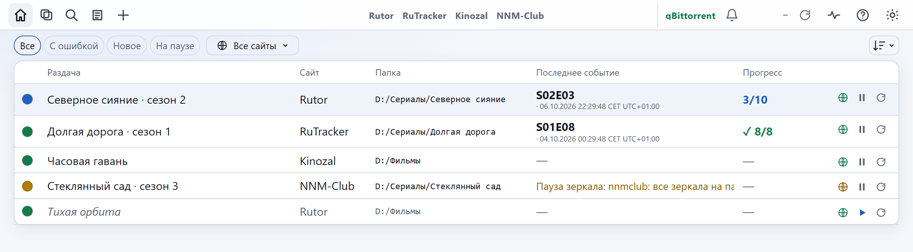

<div align="center">

# TOW

**Наблюдатель за раздачами.** Следит за темами трекеров, в которых заменяют `.torrent`, и добавляет каждую новую
версию в ваш торрент-клиент.

[](https://github.com/d0j/tow/actions/workflows/ci.yml)
[](https://github.com/d0j/tow/releases/latest)
[](LICENSE)
[](.python-version)
[](#установка)

[English](README.md) · **Русский**

[Установка](#установка) · [Работа](#работа) · [Доступ с других устройств](#доступ-с-других-устройств) ·
[Обновление и копии](#обновление-и-копии) · [Документация](#документация) · [Изменения](CHANGELOG.ru.md)

<picture>
  <source media="(prefers-color-scheme: dark)" srcset="docs/images/home-ru-dark.png">
  
</picture>

</div>

## Возможности

- **Следить или добавить один раз.** Все файлы, нужные серии (`S01E03-E05`, `04x01-03`) или маски (`*.mkv`).
- **Подтверждённое добавление.** Раздача добавляется остановленной, выбираются файлы, выбор читается обратно, и только
  потом она запускается. Сбой показывается как сбой.
- **Зеркала.** Несколько адресов сайта с перебором и паузой; дневные лимиты соблюдаются; вход по паролю или через
  окно браузера.
- **Уведомления.** Одно сообщение на раздачу за проверку, тихие часы, ежедневная сводка, очередь, которая переживает
  перезапуск.
- **История и отмена.** Записан каждый файл и каждая версия; последнее изменение можно вернуть.
- **Копии.** Подписанные ночные копии, точки восстановления, зашифрованные файлы переноса `.towx`.
- **Одна папка.** Код, настройки, данные, ключ, копии и свой Python. Папку можно перенести — всё продолжит работать.
- **Интерфейс** на русском и английском; новый язык — один JSON-файл.
- **Переходите с Monitorrent?** `tow import-monitorrent` перенесёт из него раздачи и логины сайтов.

## Что поддерживается

| | |
|---|---|
| **Сайты** | rutor, Kinozal, NNM-Club, RuTracker, Tapochek, UnionPeer, fast-torrent; другие — вручную |
| **Торрент-клиенты** | qBittorrent (веб-интерфейс), Transmission 3.0+, Deluge 2.x |
| **Уведомления** | Telegram, Discord, WhatsApp (CallMeBot), ntfy |
| **Системы** | Windows 10/11, Linux, macOS (Apple Silicon) — все три проверяются в CI |

## Установка

**Windows.** [Скачайте **TOW-windows-x64.zip**](https://github.com/d0j/tow/releases/latest/download/TOW-windows-x64.zip),
распакуйте в любое место, дважды щёлкните **Start TOW.cmd**. Всё нужное лежит в папке; для первого запуска интернет не
нужен. Или в PowerShell:

```powershell
irm https://github.com/d0j/tow/releases/latest/download/install.ps1 | iex
```

**macOS.** В Терминале:

```sh
curl -LsSf https://github.com/d0j/tow/releases/latest/download/install.sh | sh
```

Затем дважды щёлкните **Start TOW.command** в `~/TOW` или выполните `~/TOW/app/scripts/tow run`.

**Linux.** Та же команда; затем `~/TOW/start-tow`. Добавьте `-s -- --autostart` после `sh`, чтобы TOW запускался
вместе с компьютером, `--desktop` — чтобы он появился в меню приложений.

**Вручную (git).** Для разработчиков и серверов: [docs/ru/install.md](docs/ru/install.md#ручная-установка-через-git).

По шагам и с тем, что вы увидите на экране: [docs/ru/install.md](docs/ru/install.md). Все файлы:
[последний выпуск](https://github.com/d0j/tow/releases/latest). Страница открывается по адресу
**<http://127.0.0.1:8787>**.

> [!IMPORTANT]
> При первом запуске появляется `TOW/keys/master.key`. Им зашифрованы все сохранённые пароли и токены, и ни в одну
> копию он не входит. **Сразу сохраните его копию** — без ключа сохранённые входы не восстановить.

## Работа

1. **Настройки → Торрент-клиенты.** Включите в клиенте веб-интерфейс; укажите адрес, порт, логин и пароль;
   **Проверить**.
2. **Настройки → Уведомления** (по желанию). Выполните шаги «Как подключить» для мессенджера; **Проверить**.
3. **Главная → +.** Вставьте ссылку на тему, выберите папку и что скачивать, **Добавить**.
4. **Смотрите на точку.** Зелёная — подтверждено. Синяя — есть новое. Жёлтая — сайт пока недоступен. Красная —
   откройте строку: там причина.

[Руководство](docs/ru/guide.md) описывает каждый экран, состояние и сообщение.

**Командная строка.** Ниже `tow` — запускатель в `TOW/app`: `.\scripts\tow.cmd` в Windows, `./scripts/tow` в Linux
и macOS. `tow --help` показывает все команды.

| Команда | Что делает |
|---|---|
| `tow run` | единый сервис: веб-интерфейс, расписание, ночная копия, сторож |
| `tow start` | `tow run` в фоне, затем страница в браузере (это и делают файлы запуска) |
| `tow status` | одной строкой: работает ли, клиент, сайты, раздачи, прошлая и следующая проверка (`--json`) |
| `tow stop` · `tow restart` | остановить TOW · перезапустить его веб-сервер |
| `tow autostart on\|off\|status` | запуск вместе с системой |
| `tow check --apply` | проверить все раздачи сейчас |
| `tow doctor` | опросить торрент-клиент и сайты сейчас |
| `tow import-monitorrent --db ФАЙЛ` | для перехода с Monitorrent: показать, что перенесётся из его базы; с `--apply` — перенести |

Коды выхода: `0` — готово · `1` — ошибка в команде · `2` — сделано частично · `3` — запуск невозможен ·
`130` — прервано.

## Доступ с других устройств

TOW слушает `127.0.0.1:8787`. На самом компьютере пароль не спрашивается.

| Откуда | Как |
|---|---|
| Телефон или ноутбук дома или через VPN (WireGuard, Tailscale) | `tow access on` — спросит пароль, если он не задан, — затем `tow restart`; откройте `http://<компьютер>:8787` |
| Откуда угодно через SSH | `ssh -L 8787:127.0.0.1:8787 user@server`, затем откройте <http://127.0.0.1:8787> |

Запросы с адресов интернета отклоняются, поэтому проброс порта на роутере не сработает. Не ставьте TOW за обратный
прокси на той же машине: запросы прокси выглядят локальными, и пароль не спрашивается. `tow access off` закрывает
доступ по сети.

## Обновление и копии

| | Архив для Windows или `install.ps1` | `install.sh` | клон git |
|---|---|---|---|
| Обновить до последнего выпуска | дважды щёлкните `Update TOW.cmd` | `~/TOW/update-tow` · macOS: `Update TOW.command` | `.\scripts\deploy.ps1 -Ref v1.22.0` · `tow update --ref v1.22.0` покажет команду |
| Вернуться | `Update TOW.cmd v1.22.0` (не раньше v1.22.0) | `update-tow v1.22.0` (не раньше v1.22.0) | то же с прежним тегом (не раньше v1.18.0) |
| После переноса папки | `Start TOW.cmd` всё подготовит заново; затем `tow autostart on`, если он нужен | файл запуска сделает то же; затем `tow autostart on` | `tow stop`, `tow setup`, `tow autostart on` |
| Восстановить ночную копию | `tow restore-snapshot --path <копия> --apply` | так же | так же |
| Удалить | [docs/ru/install.md](docs/ru/install.md#как-удалить-tow) | так же | так же |

Обновление останавливает TOW, сохраняет снимок `data/` и `config.yaml`, переключает код, запускает TOW и проверяет
версию. Если что-то не так, откат выполняется сам. Без git оно скачивает выпуск с GitHub и сверяет его с
`SHA256SUMS` выпуска.

| Копия | Где | Примечание |
|---|---|---|
| Ночная копия | `TOW/backup/night/` | каждый день в 03:30; по умолчанию хранится 7 дней |
| Точка восстановления | `TOW/data/restore-points/` | перед рискованными изменениями, последние 10 |
| Файл `.towx` | куда сохраните | Настройки → Резервные копии; для восстановления нужен тот же `master.key` |
| `tow export` / `tow import` | куда сохраните | защищён своим паролем; переносит между установками |

В Настройках → Резервные копии можно задать число дней или отключить автоматические ночные копии,
проверить, восстановить или удалить сохранения. Прежний явно заданный счётчик копий действует до сохранения дней.
Ночные копии подписаны, но не зашифрованы целиком: настройки, раздачи и история остаются читаемыми;
пароли — зашифрованными. Не открывайте доступ к папке копий посторонним. [Подробнее](docs/ru/guide.md#резервные-копии).

## Документация

| | |
|---|---|
| [Установка](docs/ru/install.md) | по шагам для Windows, macOS и Linux; запуск, остановка, обновление, удаление; проблемы |
| [Руководство](docs/ru/guide.md) | экраны, состояния, уведомления, копии, решение проблем |
| [Установка и работа](docs/PORTABLE.md) (англ.) | устройство папки, `tow run`, автозапуск, обновления |
| [Архитектура](docs/architecture.md) (англ.) | процессы, модули, данные, восстановление, безопасность |
| [Как расширять](docs/EXTENDING.md) (англ.) | новый торрент-клиент, мессенджер, сайт, язык или страница |
| [Участие](CONTRIBUTING.md) · [Безопасность](SECURITY.md) · [Планы](docs/ROADMAP.md) | |

## Лицензия

[MIT](LICENSE) © 2026 d0j · [Сторонние компоненты](THIRD-PARTY-NOTICES.md)

TOW не связан ни с одним трекером. Он не размещает и не скачивает контент: читает страницы, на которые вы указали, и
передаёт торрент-файлы вашему клиенту. Соблюдайте правила сайтов и законы своей страны.
