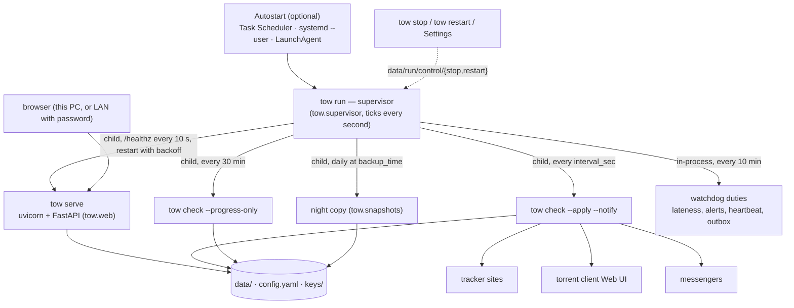

# Architecture

Download folder history is a convenience, not an access allowlist: every authorized owner device
may enter a new absolute client folder. Syntax, protected-system-folder and optional UNC checks
still run before a topic is saved or moved. The legacy `allowed_save_roots` config field is accepted
for old config/import compatibility but no longer restricts the owner. `state.save_roots` keeps up to
ten full recently used paths, newest first; older ancestor-only entries remain usable without a data
rewrite. The editable folder picker shows this entire list on its arrow, independent of typed text.

One page on how TOW is built: processes, modules, data, recovery and the security model. For running an install
see [PORTABLE.md](PORTABLE.md); for adding a client, messenger, site, language or page see
[EXTENDING.md](EXTENDING.md).

## Processes



- **`tow run`** is the single supervisor, not a single-process runtime. It holds `data/run/run.lock` (a second instance exits), starts
  every job as a child process, one job at a time, each with a time limit, and writes `data/run/status.json` only
  when something changes. A wall clock that jumps ahead of the monotonic one means the machine slept: overdue jobs
  run at once.
- **`tow serve`** is the web UI. If it exits, or holds its port without answering `/healthz` for a minute, the
  supervisor restarts it after a pause that doubles from 1 s to 5 min. It never outlives the supervisor: stopped
  on every way out of the loop, `--parent-pid` makes it stop when the supervisor is gone, a Windows job object
  and Linux `PR_SET_PDEATHSIG` end it with a killed supervisor. A server a dead supervisor left on the port (the
  pid in `status.json`, `-m tow serve` of this install) is stopped by the next `tow run`; nothing else on the
  port is ever touched.
- The schedule is the supervisor's own: checks every `interval_sec` after its last scheduled start
  (`data/run/schedule.json`), the night copy once per local day (a copy older than the latest slot is due; DST
  neither skips nor repeats a night). The watchdog duty only reports.
- Individual tracker timers override the global cadence for their topic (`check_interval_min`,
  empty/null inherits; 1–10080 minutes). Changing the interval starts a new policy revision
  from save time; unrelated edits, manual checks and progress passes do not shift it.
  `schedule.json` holds revision-bound `timer_attempts` and the single dispatched `timer_batch`.
  The supervisor coalesces overdue topics into one child job, persists its scheduled start
  before spawning, and never launches without a durable reservation. Global jobs exclude
  custom topics; the timer child re-reads pause, once completion, deletion and policy revision
  after acquiring the shared check lock. Failure still consumes a scheduled attempt, not
  an every-tick retry. Old reservations cannot delay a changed policy; clock corrections use
  the same once-pinned anchors as other jobs. Global watchdog timestamps stay separate.
  Home shows clocks and digits only; tooltips distinguish waiting, checking, pause and unknown
  scheduler state. One shared visible-page poll refreshes custom deadlines, with server time
  and a monotonic browser clock. It stops polling while the page is hidden.
- Small diagnostic JSON records are bounded to 1 MiB and the store's nesting limit before
  use. Dates must be finite, non-negative and displayable. Reading does not rewrite or quarantine
  them; an unreadable backup/watchdog record is an observation error, not success or an outage.
  New diagnostic writes follow the same limits. These limits do not cap torrent state or history.
- Restore-point and night-copy cleanup are folder-scoped observations: pending, complete or unknown.
  Losing its record retains the watchdog's last confirmed result and raises a separate
  observation alert. Readability recovery does not confirm cleanup; a folder change cannot
  resolve an old folder's warning. Missing records on a fresh install are not failures.
  A digest of archive or committed copy names binds a result to its inventory independently of wall-clock
  order. A new archive without a new monitoring write makes the old result unknown;
  an unbound legacy warning is retained, but unbound success needs a fresh observation.
  Readable legacy metadata is not a folder-access outage during migration. Once a bound
  result has been observed for a folder, losing its binding is an observation error.
  Night-copy creation, pruning and its monitoring write share the data lock; readers take
  the same lock to avoid comparing a committed copy with an unfinished monitoring write.
- A future scheduler fact after a backward clock correction is anchored once to its first
  observation, per fact source; repeated ticks do not move its deadline. Fresh job starts
  replace the corresponding anchor. Calendar backup slots remain wall-clock based; process
  timeouts still use the monotonic clock, which cannot supply dates across process restarts.
- Other processes never send signals: they write a request file into `data/run/control/` and the supervisor polls
  it. SIGTERM and Ctrl+C stop it the same way.
- **Checks** hold `check_run_lock` for their whole run (one applying check at a time across processes) and take
  the data lock only to read and to commit, so the UI never waits for tracker or client network time.

## Modules

| Package / module | Role |
|---|---|
| `tow.cli` | Every command (`run`, `serve`, `check`, `autostart`, `update`, `keys`, `export`…). `setup` lives in the launchers (`scripts/tow.cmd`, `scripts/tow`). |
| `tow.supervisor` | `tow run`: the loop (`core`), timing with a fake-clock-testable schedule (`schedule`), its files (`layout`). |
| `tow.web` | FastAPI app built by `create_app()`: one `APIRouter` per `routes_*.py`, the request middleware, templates. Everything outside the package is called through `tow.web.services`. |
| `tow.check`, `check_steps`, `check_transaction` | A check run: fetch, decide, hand to the client, record — with a journal for the commit. |
| `tow.trackers` | `generic.GenericHttpTracker` reads any configured site; `presets/<site>.py` adds what TOW knows about a particular site. `tow.mirrors` picks mirrors, cooldowns, redirects. |
| `tow.clients` | Torrent adapters behind `TorrentClientAdapter`; Transmission and Deluge use `managed.ManagedClient`, while qBittorrent implements the same read-back contract separately. |
| `tow.notifiers` | One module per messenger behind the `Notifier` protocol; `outbox` is the per-recipient delivery queue; `tow.delivery` groups, delays and digests. |
| `tow.selection`, `tow.episodes`, `tow.torrent` | Which files to download; episode parsing; bencode and info-hash. |
| `tow.content` | Encrypted, bounded metadata preparation snapshots; literal file identities for graphical selection, without transfer-task mutations or media retrieval. Explicit native magnet preview is separate from the mutating add fallback and from dry-run. |
| `tow.store`, `tow.store_transaction`, `tow.site_journal` | State, history, encrypted secrets; the data lock; journaled multi-file writes. |
| `tow.undo` | One undo engine: a record per change, restored through one transaction. |
| `tow.access`, `tow.auth` | Password, sessions, this-computer-only actions. |
| `tow.snapshots`, `tow.restore_points`, `tow.bundle` | Night copies, restore points, `.towx` export and import. |
| `tow.releases`, `tow.web_update`, `tow.update_worker` | Cached read-only release discovery; serialized web launch with a verified archive; an isolated standard-library worker outside `app/`, an exiting-parent handoff (local Windows broker for inherited outer jobs), independence checks before stopping TOW, durable progress and the existing updater's rollback. |
| `tow.watchdog`, `tow.pulse` | Is TOW up and on schedule; why it was silent (from facts the OS keeps). |
| `tow.autostart` | Task Scheduler, systemd user unit, LaunchAgent — each change read back. |
| `tow.platform` | Every OS difference (boot time, sleep, processes, browsers, protected folders). |
| `tow.paths` | Every location, derived from one install root. |
| `tow.i18n`, `tow.errors` | Language catalogs; typed errors (`TowError(key, **params)`) rendered in the reader's language. |

Rule previews use the applying check's season parser and selection engine. They read saved
tracker titles only for the same topic source and client; otherwise the current form title
provides context. Future watch ranges are waiting, not failures, while once ranges remain
strict. Preview refreshes do not fetch trackers or mutate clients, and stale title/lifecycle
responses are discarded. An applying check still obtains the current tracker title independently.

Episode rules build a per-call index of available numbers and season maxima. Repeated or
overlapping requests are matched once per distinct label; waiting checks use those maxima,
not another scan of all files. The original first ten diagnostic labels, including repeats,
remain in input order. Subtitle season context still contributes to ambiguity. The index is
not a persistent cache and does not change saved policies, file priorities or history identities.

## Data layout

```text
<install>/
  app/                     the code: a git clone at a release tag, or a release archive
  config.yaml              settings and sites (no secrets)
  data/
    state.json             topics, their status, undo record, pending notifications
    download_history.json  files of every revision
    secrets.enc            passwords, tokens, cookies, password record — Fernet, master key
    secrets-undo.enc       the secrets before the last undoable change
    sessions.json          revoked network sessions
    tow.jsonl              structured events — rotated
    restore-points/        restore points (.towx)
    logs/                  process and job output (including serve.log) — rotated
    run/                   supervisor lock, pid, status, schedule, control/
    tmp/                   private temp folder (cleaned after a day)
    browser-auth/          temporary browser profiles for site sign-in
  keys/master.key          the master key — outside data/, so no copy of data/ carries it
  backup/                  night/ copies, update-…-before-… snapshots
  runtime/                 Python and uv cache of this install
    web-update/            durable job record, copied worker/updater and bounded UI log access
```

`tow.paths.root()` finds the install: `TOW_ROOT`; else the parent of an `app` code folder that has `config.yaml`
or `data/` next to it; else the development checkout itself. Nothing is written outside the install except the
autostart entry, and that only on request.

The detached update worker holds its per-job OS lease throughout the installation. Its initial acquisition
retries nonblocking calls for at most one second on a monotonic clock, so a brief status probe does not abort
the handoff. After acquisition it re-reads the unchanged queued job and checks its 30-second handoff expiry
again before starting. A busy lease never grants ownership or permission to overwrite another worker's result.
The copied Python 3.11 worker enforces the job journal's 64 KiB, finite-number and nesting
limits independently of the replaceable app. Even a handoff refusal takes the lease and
re-reads the unchanged queued reservation before publishing a result. Damaged records or
leases are retained, not reconstructed or turned into terminal results without ownership.
Journal writes validate before an exclusive temporary file, fsync and atomic replace;
current-state schema preflight uses strict JSON without the small job-size cap.
Every worker entry binds its journal and nonce to the copied script's own job folder;
relays use the derived path, not the supplied filename, after checking path equivalence.
The trusted producer resolves the install path; the worker's supplied-name check is lexical
and does not inspect a foreign path. Install-root aliases therefore remain supported.
The app validates displayable job timestamps for every phase before status, log or launch
decisions; unreadable dates fail closed without modifying the journal.

## Recovery

Backup lists are compact, closed by default, and offer Check, Restore and Delete for
both kinds. Deletion has a dated server confirmation (also without JavaScript) and
is bound to the copy's location and regular-file metadata. A changed selection is
refused. Only the selected copy is removed and absence is read back; it is not undoable.
Signed night-copy metadata and the owned tree prevent deletion of foreign files or links.
Explicit manual deletion can remove a damaged ordinary archive without decrypting it.
Deleting one copy rebinds a known cleanup observation without clearing previous warnings.

New night-copy policies default to `backup_days: 7`. Existing explicit `backup_keep`
count policies remain supported until days are saved. Retention follows a verified new
copy; that copy is always protected. Age uses signed creation time relative to the new
copy, and future-dated copies are kept after a clock correction. An optional
`backup_max_mib` can shorten history, but never removes the new copy or foreign data.
Insufficient room for the full new copy plus a reserve refuses creation before pruning.
`backup_enabled: false` removes scheduled backup jobs and stale-copy alerts, not
manual actions or cleanup monitoring. Already running jobs finish normally.

Night-copy creation reads regular sources in bounded blocks and hashes the same bytes
it writes to exclusive prepared files. Opened descriptors, complete byte counts and
modification times are checked; a disappearing or changing source cannot publish a
successful copy. The event-log lock prevents concurrent append/rotation while copied.
Payload files and the bounded signed manifest are flushed/fsynced before the directory
is published. Destination read-back and semantic validation still precede retention;
this does not bound semantic JSON parsing or applied-restore plans, or change copy formats.

Night-copy verification and preview first stream-check every member's signed hash, then
read and re-check one semantic store at a time before parsing it. Opaque logs and nested
archives are not retained. Regular-file and opened-descriptor checks refuse special files,
links and inconsistent sizes. An applied restore requires a signed manifest and retains its
checked bytes for the transaction; it never re-reads an unchecked source to write live data.
This reduces verification memory, not the full applied-restore transaction's memory footprint.

Night-restore metadata uses separate byte budgets: the marker is limited to 64 KiB,
the journal to 4 MiB (with headroom for every member of a supported 1 MiB manifest).
Opened regular records are size-checked before reading and strict JSON decoding; changed
or unreadable records are preserved and never treated as successful recovery. Marker
discovery uses lstat, so dangling links do not disappear from recovery checks. Producers
preflight every final journal phase before publishing the marker; legacy rollback checks
its final record before any live write. Cleanup proof reads obey the same metadata limits.
These bounds do not limit state/history payloads or remove the full restore's memory plans.

Every multi-file write is journaled; whichever TOW process next takes the data lock (`persistence_lock`) runs the
registered recovery hooks first, so no process ever reads half-written stores.

Event-log writes also take the data lock before the log lock: a writer after a crash
must recover a prepared night restore before accepting an event that rollback would
otherwise erase. A night restore holds the log lock continuously from safety capture
through verified application or rollback, including the final journal/marker write.
Crash rollback takes the same log barrier. Readers, append and rotation cannot observe
or change an unfinished replacement. Audit and cleanup events run outside the OS log
barrier, which is not reentrant. A recovery refusal makes append return false; diagnostic
logging must not turn an already-confirmed client operation into a reported client failure.

| Journal | Protects | On a crash |
|---|---|---|
| Check transaction (`data/.tow-check-transaction/`) | `state.json` + `download_history.json` of one check | rolled back or completed |
| Store transaction (`tow.store_transaction`, `tow.site_journal`) | `config.yaml` + `state.json` + secrets + undo snapshot (site edits, settings, undo, Monitorrent import) | all four back as before |
| Import checkpoint (`tow.backup`) | `.towx` imports | rolled back |
| Night restore marker (`.tow-night-restore.json`) | restoring a night copy | previous data put back |

Single files are written atomically (temp file, fsync, rename). `state.json` carries a data version: an older TOW
refuses newer data instead of damaging it. Notifications are staged in the same write as the check result and
moved to the outbox in one locked write, so a stop between them loses nothing.

## Security model

| Concern | How |
|---|---|
| Who may ask | A loopback peer (this computer) needs no password. Other peers are refused unless network access is on, and then need a session. Peers with a public internet address are always refused, whatever `Host` says. |
| Host header | Only `localhost`, non-public IP literals, this computer's name (`<name>`, `<name>.local`) and the configured bind name are accepted (DNS rebinding). |
| Password | PBKDF2-SHA256, 600 000 iterations, in the encrypted secrets; optional reminder, never containing the password. Login attempts are throttled per address and globally. |
| Sessions | `tow_session` cookie: HttpOnly, SameSite=Lax, 90 days, signed with a key derived from the password record (a new password signs every device out); revocations survive restarts. |
| CSRF | Every POST/PUT/PATCH/DELETE must carry an `Origin` equal to the request's own origin. |
| Page | CSP `default-src 'self'` (no inline script or style, no framing), `X-Frame-Options: DENY`, `nosniff`, `Referrer-Policy: same-origin`. Flash messages travel as a server-side token, never as text in the URL. |
| Local-only actions | Turning network access on or off and the first-start page: this computer only. |
| Secrets at rest | `secrets.enc` (Fernet). The master key lives in `keys/`, never in data copies; night copies are signed with a key derived from it. |
| Outbound requests | Site addresses entered in the web UI that resolve to private, loopback or CGNAT ranges are refused (SSRF); download redirects may not leave the site's configured hosts. |
| Folders | Downloads and backups may not go into system or profile folders on any OS (8.3 names, trailing dots and links included). |
| Torrents | TOW only changes torrents tagged `tow`; a client add counts only after read-back. |

Not covered: a reverse proxy on the same host makes every request look local, and anyone with access to the
user account (or the `keys/` folder) can read the secrets. See [SECURITY.md](../SECURITY.md).

## Code API: paths and platform

Stable names other modules build on.

`tow.paths` — nothing else in TOW derives a path on its own:

| Function | Path | Created by the call |
|---|---|---|
| `root()` | the install root | no |
| `repo_root()` | the code folder (`<install>/app`, or the dev checkout) | no |
| `data_dir()` | `TOW_HOME`, else `<root>/data` | yes |
| `config_path()` | `TOW_CONFIG`, else `<root>/config.yaml` (must exist) | no |
| `keys_dir()` / `key_file()` | `<root>/keys` / `<root>/keys/master.key` | no |
| `tmp_dir()` | `<data>/tmp` | yes |
| `logs_dir()` | `<data>/logs` | yes |
| `run_dir()` | `<data>/run` (pid, lock, `control/`) | yes |
| `backup_root()` | `<root>/backup` | no |
| `runtime_dir()` | `<root>/runtime` (`python/`, `cache/`, `bin/uv`) | no |
| `use_private_temp()` | points `tempfile` and `TMP`/`TEMP`/`TMPDIR` at `tmp_dir()` | yes |

`tow.platform` — everything that differs between Windows, Linux and macOS:

- `current()` returns this machine's backend; `use(backend)` (a context manager) and `set_backend(backend | None)`
  inject another one in tests; `backend_for("windows" | "linux" | "macos")` builds one by name.
- A backend has `name` and:
  - `boot_time(now=None)`, `asleep_seconds()`, `logon_time()` — unix times or seconds, `None` when unknown;
  - `shutdown_reasons(since, until)` — shutdown records, oldest first, `[]` when unknown;
  - `spawn_detached(argv, *, hidden=True, log_path=None, cwd=None, env=None, require_breakaway=False)` → pid (outlives the parent; no
    console window on Windows; own session on POSIX);
  - `publish_exclusive(source, destination)` — publish complete prepared bytes without replacing an occupied
    name (Windows rename, POSIX hard link; unsupported destinations fail closed);
  - `popen_options(*, new_group=False, hidden=True)` — the same flags for a `subprocess.Popen` the caller keeps;
  - `process_alive(pid)`, `terminate(pid, timeout=10.0)` (the whole tree or process group) → bool;
  - `process_command(pid)` → command line or `None` when unknown; read-only, used to identify pre-lease update workers;
  - `bind_children()` → bool: Windows puts this process into a kill-on-close job object its later children
    inherit (they end with it; `spawn_detached` still breaks away); `False` elsewhere;
  - `die_with_parent(parent_pid)` → bool: Linux asks for SIGTERM when the parent ends (`PR_SET_PDEATHSIG`);
    `False` elsewhere;
  - `port_owner(port)` → `{pid, cmd, parent, parent_cmd}` or `None`;
  - `browser_executables()` — Chromium-family browsers found, best first;
  - `bring_to_front(pid)` — Windows only; no-op elsewhere;
  - `protected_folders()` — folders a download or backup must never go to;
  - `open_url(url)` → bool.
